# react-magiceye

A React canvas component that renders autostereograms (Magic Eye images)
client-side, using the procedural Single Image Random Dot Stereogram (SIRDS)
algorithm from Harold Thimbleby's paper "Displaying 3D Images: Algorithms for
Single Image Random Dot Stereograms".

Every scene is generated live in the browser from a mathematical depth map and
a procedurally generated dot pattern — no image assets required.

## Install

```bash
git clone git@github.com:EthanThatOneKid/react-magiceye.git
cd react-magiceye
bun install
bun run typecheck
```

## Example

```tsx
import { MagicEyeCanvas, sphere } from "react-magiceye";

export function Demo() {
  return (
    <MagicEyeCanvas
      width={640}
      height={480}
      depth={sphere}
      palette="dots"
    />
  );
}
```

## `MagicEyeCanvas` props

| Prop             | Type                       | Default            | Description                                                              |
| ---------------- | -------------------------- | ------------------ | ------------------------------------------------------------------------ |
| `width`          | `number`                   | — (required)       | Render resolution width.                                                 |
| `height`         | `number`                   | — (required)       | Render resolution height.                                                |
| `depth`          | `DepthFn`                  | — (required)       | Depth function: `(x, y, w, h) => 0..1` where 0 = far, 1 = near.          |
| `palette`        | `"dots" \| "rainbow" \| "candy" \| "mono"` | `"dots"` | Pattern flavor. Dots = classic high-contrast random dots.                |
| `eyeSeparation`  | `number`                   | `round(w / 3.2)`   | Eye separation in pixels. Larger = pattern repeats less often.           |
| `mu`             | `number`                   | `1/3`              | Depth-of-field fraction; higher = stronger depth range.                  |
| `seed`           | `number`                   | `1337`             | PRNG seed. Bump it to regenerate the pattern.                            |
| `showDepth`      | `boolean`                  | `false`            | Render the raw depth map instead of the stereogram.                      |
| `onRendered`     | `(canvas) => void`         | —                  | Called with the rendered canvas after each draw.                         |

## Depth functions

The library ships a set of ready-made `DepthFn`s: `sphere`, `pyramid`,
`ripples`, `wave`, `cone`, `heart`, `torus`, and `makeTextDepth("3D")` for
raised text. `SCENES` pairs each depth map with a title, hint, and suggested
palette for the gallery demo.

Any function `(x, y, w, h) => 0..1` works, so you can also supply your own.

## Headless usage

`renderStereogram` and `renderDepthMap` return `ImageData` directly, so the
renderer can be used without React:

```ts
import { renderStereogram, sphere } from "react-magiceye";

const img = renderStereogram({
  width: 640,
  height: 480,
  depth: sphere,
  palette: "dots",
});
```

## Preview gallery

Real output of the library, rendered headlessly — every stereogram below is
`renderStereogram` output for the matching `SCENES` entry (560×380, default
seed), and each has its `renderDepthMap` hidden shape behind a click.
Regenerate them with `node scripts/generate-previews.mjs`.

| | |
|---|---|
| **Floating Sphere** — a smooth ball hovers in front of the noise.<br/>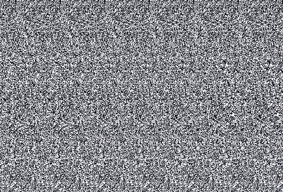<details><summary>Show depth map</summary>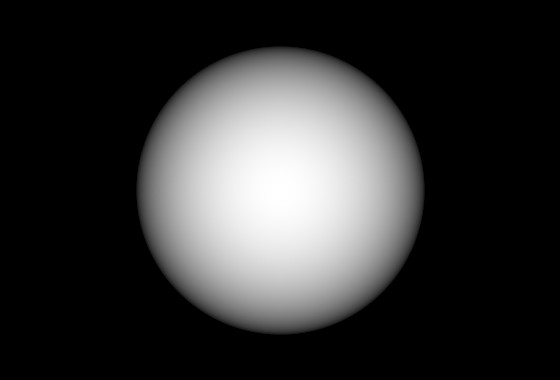</details> | **The Word “3D”** — bold letters pop out toward you.<br/>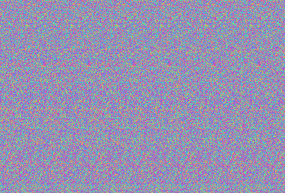<details><summary>Show depth map</summary>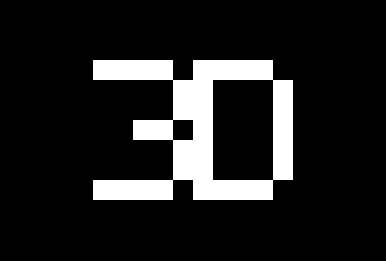</details> |
| **Water Ripples** — concentric rings recede into a pond.<br/>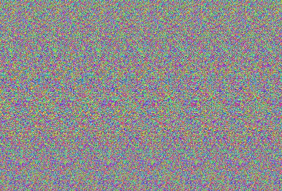<details><summary>Show depth map</summary>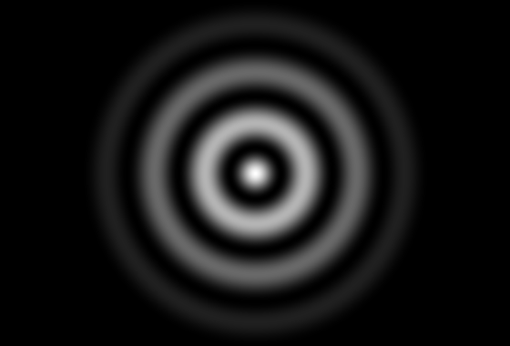</details> | **Rising Pyramid** — a four-sided pyramid tips toward you.<br/>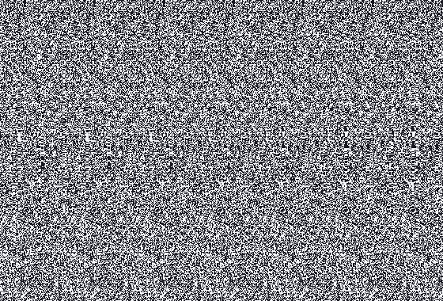<details><summary>Show depth map</summary>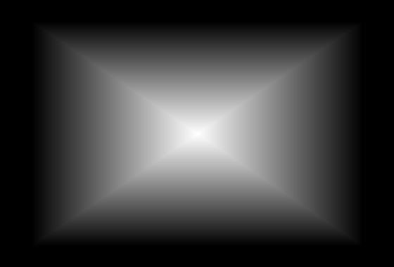</details> |
| **Raised Heart** — a heart lifts off the background.<br/>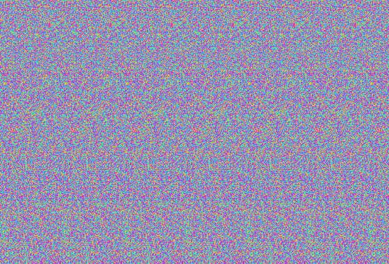<details><summary>Show depth map</summary>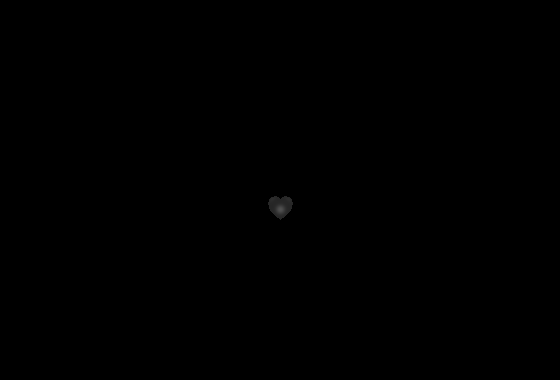</details> | **Donut / Torus** — a ring floats with a hole in the middle.<br/>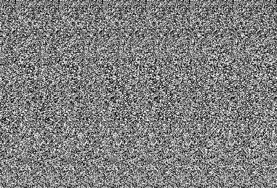<details><summary>Show depth map</summary>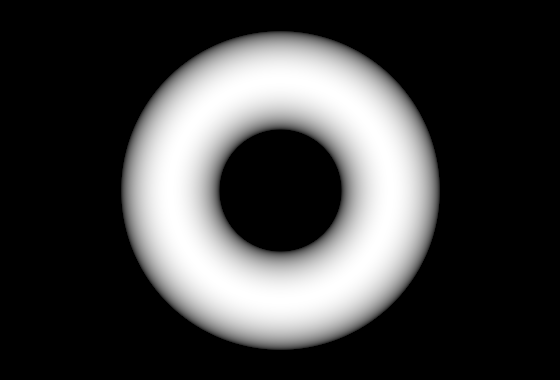</details> |
| **Rolling Waves** — a rolling hill-and-valley surface.<br/>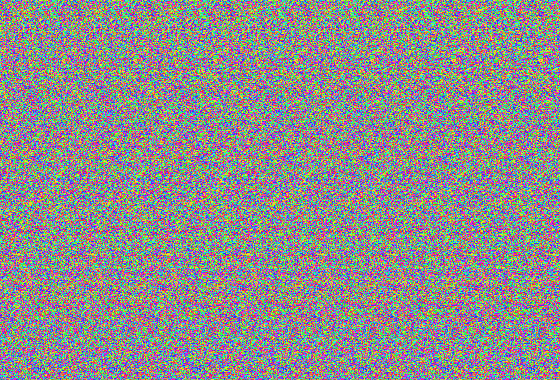<details><summary>Show depth map</summary>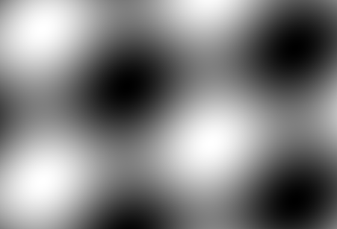</details> | **Sharp Cone** — a cone points straight at your eyes.<br/>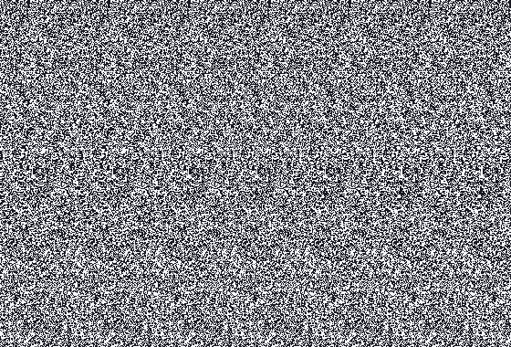<details><summary>Show depth map</summary>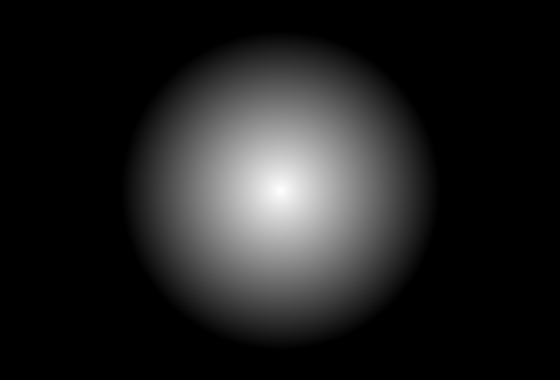</details> |

Relax your eyes and let them drift *past* the screen until the two patterns
fuse — each image hides its 3D shape. Stuck? Click **Show depth map** under
any image to reveal the hidden shape.

## Notes

- The renderer is deterministic: the same depth map, palette, and seed always
  produce the same image.
- Renders synchronously to a canvas; heavy resolutions will block briefly.
- The algorithm applies Thimbleby's separation formula `s = (1 − μz)·E / (2 − μz)`
  with a per-scanline hidden-surface visibility check.
